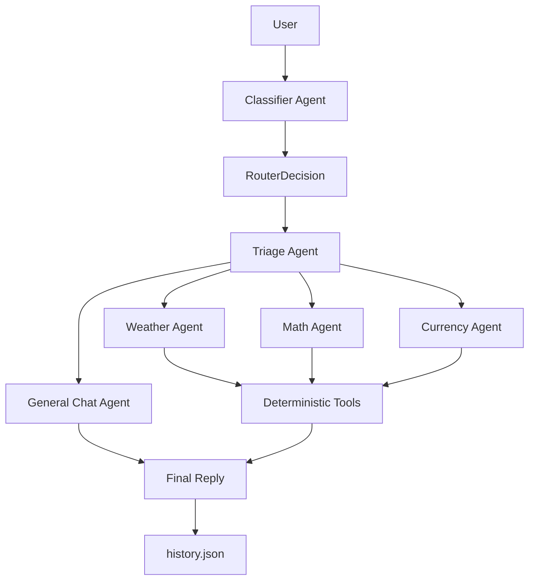

# Architecture Summary

## Overview

The system is a modular OpenAI Agents SDK application. It keeps the Assignment 1 capabilities (weather, math, exchange rates, general chat, and memory), but moves routing and execution into an agent architecture with tools, handoffs, structured output, and guardrails.



## Agents

- `Classifier Agent` classifies the user input into `getWeather`, `calculateMath`, `getExchangeRate`, or `generalChat`. It uses Few-Shot prompting with at least three examples per category and returns a Pydantic structured output: `intent`, `parameters`, and `confidence`.
- `Triage Agent` receives the structured routing decision and performs SDK handoffs to the correct specialist.
- `Weather Agent` calls `get_weather`.
- `Math Agent` translates direct math or word problems into a clean expression and then calls `calculate_math`. The LLM does not calculate the result itself.
- `Currency Agent` calls `get_exchange_rate`.
- `General Chat Agent` handles safe general conversation using the required persona: a cynical but helpful research assistant that sometimes uses Data Engineering metaphors.

## Tools

- `get_weather(city)` uses Open-Meteo geocoding and forecast APIs.
- `calculate_math(expression)` evaluates arithmetic with Python AST and only allows numbers, `+`, `-`, `*`, `/`, parentheses, and unary signs.
- `get_exchange_rate(currencyCode)` uses Frankfurter to fetch the rate from the requested currency to ILS.

## Handoffs

The `Triage Agent` declares the four specialist agents in its `handoffs` list. The routing decision is passed into the triage prompt, and the SDK performs the handoff to the matching specialist. The demo shows at least two real handoff paths, including weather and math.

## Guardrails

Input guardrails:

- Deterministic validation blocks empty input, extremely long input, control characters, and obvious harmful patterns such as `rm -rf`, `DROP TABLE`, or keylogger requests.
- An SDK `input_guardrail` runs a `SafetyCheck` agent and blocks political questions, malware, credential theft, destructive scripts, and illegal abuse.

Output guardrails:

- Deterministic validation blocks empty output and leaked router JSON.
- An SDK `output_guardrail` runs a `SafetyCheck` agent and blocks harmful content, political persuasion, exploit guidance, and security bypass instructions.

Blocked requests return:

```text
I cannot process this request due to safety protocols.
```

## Memory

Conversation history is stored in `history.json`. The app loads it on startup, saves it after each turn, and supports `/reset` to clear it. The latest history is injected into the triage input so the general chat path can answer follow-up questions after a restart.
